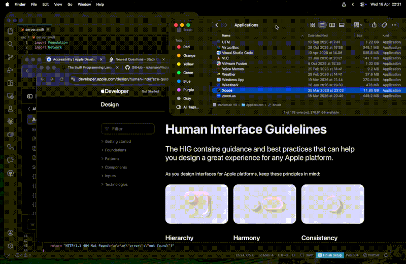
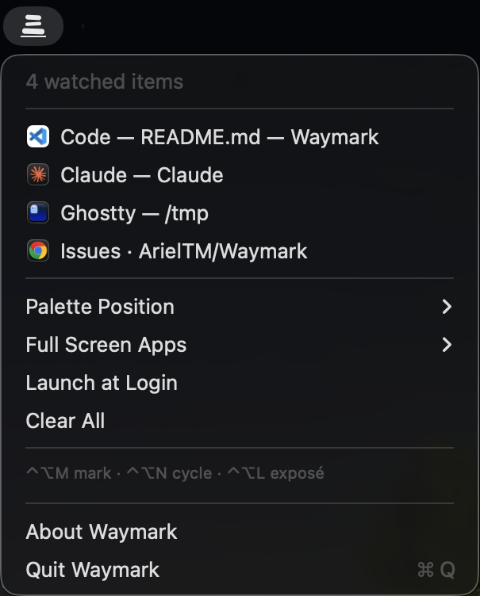
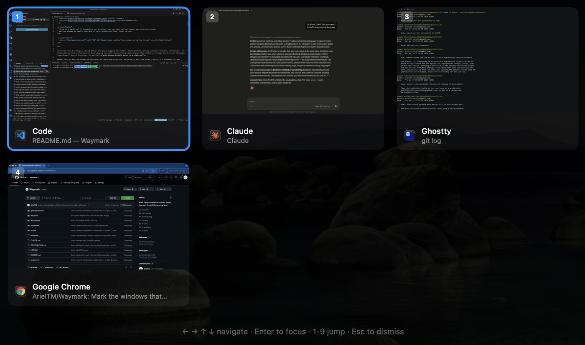
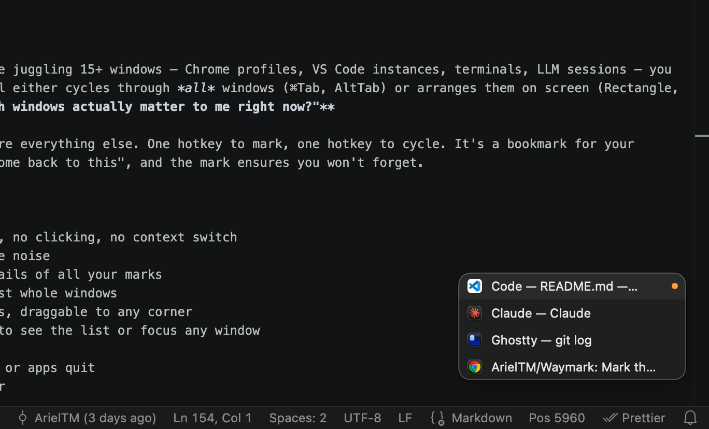

<p align="center">
  
</p>

<h1 align="center">Waymark</h1>

<p align="center">
  Mark the windows that matter. Forget the rest.
</p>

<p align="center">
  
  
  
  
</p>

<p align="center">
  <b>The first macOS tool for bookmarking your attention — not your tabs, not your layout, your attention.</b><br>
  Mark the windows you need to come back to, cycle through only those, forget the rest.
</p>

<p align="center">
  
</p>

---

Your brain holds 3–5 things in working memory. When you're juggling 15+ windows — Chrome profiles, VS Code instances, terminals, LLM sessions — you forget what you need to check back on. Every existing tool either cycles through *all* windows (⌘Tab, AltTab) or arranges them on screen (Rectangle, Stage Manager). None of them answer the question: **"which windows actually matter to me right now?"**

Waymark lets you mark the windows you care about and ignore everything else. One hotkey to mark, one hotkey to cycle. It's a bookmark for your attention — you mark a window when you think "I need to come back to this", and the mark ensures you won't forget.

## Features

- **Mark/unmark** any window in one keystroke — no typing, no clicking, no context switch
- **Cycle** through only your marked windows, skipping the noise
- **Exposé panel** — full-screen overlay with live thumbnails of all your marks
- **Chrome tab tracking** — marks individual tabs, not just whole windows
- **Floating palette** — always-visible list of your marks, draggable to any corner
- **Menu bar** — cairn icon shows your mark count; click to see the list or focus any window
- **Gesture support** — Option + trackpad swipe to cycle
- **Auto-cleanup** — marks are removed when windows close or apps quit
- **Launch at Login** — optional, toggle from the menu bar
- Works across all apps. Zero dependencies. Pure Swift.

## Install

**Homebrew:**

```bash
brew install --cask atrandom/tap/waymark
```

**Manual:** Download the latest `.dmg` from [GitHub Releases](https://github.com/ArielTM/Waymark/releases), open it, drag **Waymark** to **Applications**.

> **Note:** Waymark is not notarized yet. On first launch, macOS will block it. Right-click the app → **Open** → click **Open** in the dialog. You only need to do this once.

## Hotkeys

| Hotkey | Action |
|--------|--------|
| `⌃⌥M` | Toggle mark on focused window |
| `⌃⌥N` | Cycle forward through marks |
| `⌃⌥⇧N` | Cycle backward |
| `⌃⌥L` | Exposé panel (thumbnails of all marks) |
| `⌃⌥C` | Clear all marks |

Also: **Option + trackpad swipe** left/right to cycle.

## Usage

<table>
  <tr>
    <td align="center" width="33%"><a href="#menu-bar"></a></td>
    <td align="center" width="33%"><a href="#exposé-panel"></a></td>
    <td align="center" width="33%"><a href="#floating-palette"></a></td>
  </tr>
  <tr>
    <td align="center"><b>Menu Bar</b><br><sub>click the cairn icon</sub></td>
    <td align="center"><b>Exposé Panel</b><br><sub><code>⌃⌥L</code></sub></td>
    <td align="center"><b>Floating Palette</b><br><sub>always visible</sub></td>
  </tr>
</table>

### Menu Bar

- Cairn icon: outline when empty, filled + count when marks exist
- Click to see the list, focus any window, or clear all
- Toggle **Launch at Login**

### Exposé Panel

Press `⌃⌥L` to show a full-screen overlay with thumbnails of all marked windows.

- **Arrow keys** to navigate the grid
- **Enter** to focus the selected window
- **1–9** to jump directly to a window by number
- **Escape** or click outside to dismiss

### Floating Palette

An always-visible list of your marked windows with app icons.

- Drag to any corner of the screen
- Hides automatically on full screen

## Permissions

Waymark needs a few macOS permissions to do its job. You'll be prompted on first launch.

**Accessibility** (required)
Waymark uses the Accessibility API to detect global hotkeys (via CGEventTap) and to focus, raise, and manage windows across all apps (via AXUIElement). Without this, hotkeys won't work and windows can't be switched.

**Screen Recording** (optional)
Used to capture live window thumbnails for the Exposé panel (via ScreenCaptureKit). Without it, Waymark shows app icons as placeholders instead — everything else works normally.

**Automation** (optional)
Needed for Chrome tab tracking. Waymark uses AppleScript to enumerate and switch individual Chrome tabs. Without it, Chrome windows are tracked as whole windows only.

<details>
<summary>Manual permission grant instructions</summary>

### Accessibility

1. Open **System Settings > Privacy & Security > Accessibility**
2. Click the **+** button
3. Navigate to and add `Waymark.app`
4. Enable the toggle

### Screen Recording

1. Open **System Settings > Privacy & Security > Screen Recording**
2. Click the **+** button
3. Add `Waymark.app`
4. Enable the toggle

### Automation

Granted automatically via a one-time dialog when Waymark first tries to control Chrome. Click **OK** to allow.

> **Note:** On macOS 15 (Sequoia), you may need to re-authorize Accessibility and Input Monitoring periodically.

</details>

## Building from Source

Requires macOS 14.0+, Xcode 15+, and [XcodeGen](https://github.com/yonaskolb/XcodeGen) (`brew install xcodegen`).

```bash
xcodegen generate
xcodebuild -scheme Waymark -configuration Debug build
```

Or open `Waymark.xcodeproj` in Xcode and hit Run.

## How It Works

- **Mark/Unmark:** Gets the focused window via the Accessibility API, stores its window ID
- **Cycle:** Focuses the next/previous window in your watchlist using AXUIElement + NSRunningApplication
- **Auto-cleanup:** Watches for app termination and window closure; validates the watchlist every 5 seconds
- **Thumbnails:** Captured via ScreenCaptureKit (SCScreenshotManager)
- **Global hotkeys:** Registered via CGEventTap

## Uninstall

1. Quit Waymark (click the menu bar icon → **Quit**)
2. Delete `Waymark.app` from Applications
3. Optionally remove preferences: `defaults delete io.atrandom.Waymark`

If installed via Homebrew: `brew uninstall waymark`

## Contributing

Contributions welcome! Check out the [open issues](https://github.com/ArielTM/Waymark/issues) — issues labeled **good first issue** are a great starting point.

To build from source, see [Building from Source](#building-from-source) above.

Found a bug? Have an idea? [Open an issue](https://github.com/ArielTM/Waymark/issues/new).

## License

[MIT](LICENSE)
